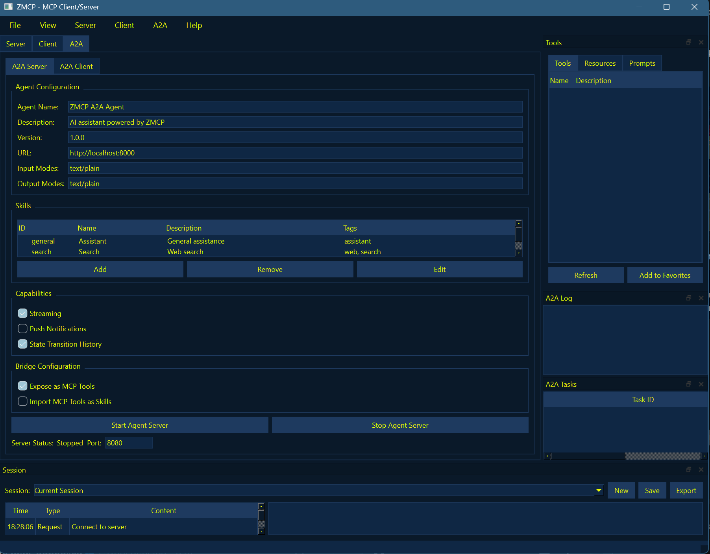

# ZMCP - MCP+A2A Client/Server

ZMCP is a desktop application implementing the Model Context Protocol (MCP) and A2A protocols.
It provides both server and client capabilities in a modern, modular interface.



## Features

### Server Features
- **Flexible Server Configuration**: Dynamically load and configure multiple MCP tool providers with visual configuration interface
- **Tool Management**: Predefined tools with easy-to-use interfaces
- **Protocol Support**: Full MCP specification compliance with support for tools, resources, and prompts
- **Performance Monitoring**: Track server activity and performance metrics

### Client Features
- **Server Connection Management**: Connect to multiple MCP servers with secure authentication
- **Tool Discovery and Usage**: Automatically discover and use tools from connected servers
- **Interactive Session Management**: Create, save, and manage interaction sessions
- **Response Visualization**: Display various content types in rich text format

## Installation

### Setup

1. Clone the repository:
```bash
git clone https://github.com/mexyusef/zmcp.git
cd zmcp
```

2. Install dependencies:
```bash
pip install -r requirements.txt
```

## Usage

### Running the Application

Run the application using the provided startup script:
```bash
python run.py
```

### Server Mode

1. Go to the "Server" tab
2. Configure the server settings
3. Add and configure tools
4. Click "Start Server" to begin hosting

### Client Mode

1. Go to the "Client" tab
2. Enter the server URL (e.g., http://localhost:8000)
3. Click "Connect" to connect to the server
4. Browse available tools, resources, and prompts
5. Select and use tools with the provided interface

## Predefined Tools

ZMCP comes with several predefined tools:

- **Web Fetch**: Fetch content from web URLs
- **System Info**: Get information about the system
- **File Manager**: Read, write, and list files
- **Process Manager**: Execute and manage processes
- **Memory Tool**: Store and retrieve memories

## Customization

ZMCP can be customized in various ways:

- **Theme**: Choose between light and dark themes
- **Layout**: Adjust panel positions and visibility
- **Server Configuration**: Configure server settings through the visual interface
- **Tool Configuration**: Enable/disable and configure individual tools

## Bridge Module

The ZMCP bridge module provides a way to connect the MCP and A2A protocols, allowing:

1. **MCP Tools as A2A Agents**: Convert MCP tools to A2A agents using the `MCPToolToA2AAgent` class.
2. **A2A Agents as MCP Tools**: Convert A2A agents to MCP tools using the `A2AAgentToMCPTool` class.

### Examples

#### Converting an MCP Tool to an A2A Agent

```python
from zmcp.core.mcp import Tool as MCPTool
from zmcp.bridge.mcp_to_a2a import MCPToolToA2AAgent

# Create an MCP tool
async def handler(**kwargs):
    return [{"type": "text", "text": f"Tool response: {kwargs.get('input', '')}"}]

mcp_tool = MCPTool(
    name="calculator",
    description="A simple calculator tool",
    handler=handler,
    input_schema={
        "type": "object",
        "properties": {
            "input": {
                "type": "string",
                "description": "Math expression to calculate"
            }
        }
    }
)

# Convert to A2A agent
bridge = MCPToolToA2AAgent(mcp_tool)

# Create a FastAPI app for the A2A agent
app = bridge.create_app()

# Run the app
import uvicorn
uvicorn.run(app, host="0.0.0.0", port=8000)
```

#### Converting an A2A Agent to MCP Tools

```python
import httpx
from zmcp.a2a.types import AgentCard
from zmcp.bridge.a2a_to_mcp import A2AAgentToMCPTool

# Create or load an agent card
agent_card = AgentCard(
    id="math-agent",
    name="Math Agent",
    description="An agent that can do math",
    skills=[
        {
            "id": "calculate",
            "name": "Calculate",
            "description": "Calculate a math expression"
        }
    ]
)

# Create the bridge
bridge = A2AAgentToMCPTool(agent_card)

# Get the MCP tools
tools = bridge.get_tools()

# Use the tools
async def use_tools():
    result = await tools[0].handler(text="2 + 2")
    print(result)

# Clean up
await bridge.close()
```

## License

[MIT License](LICENSE)
